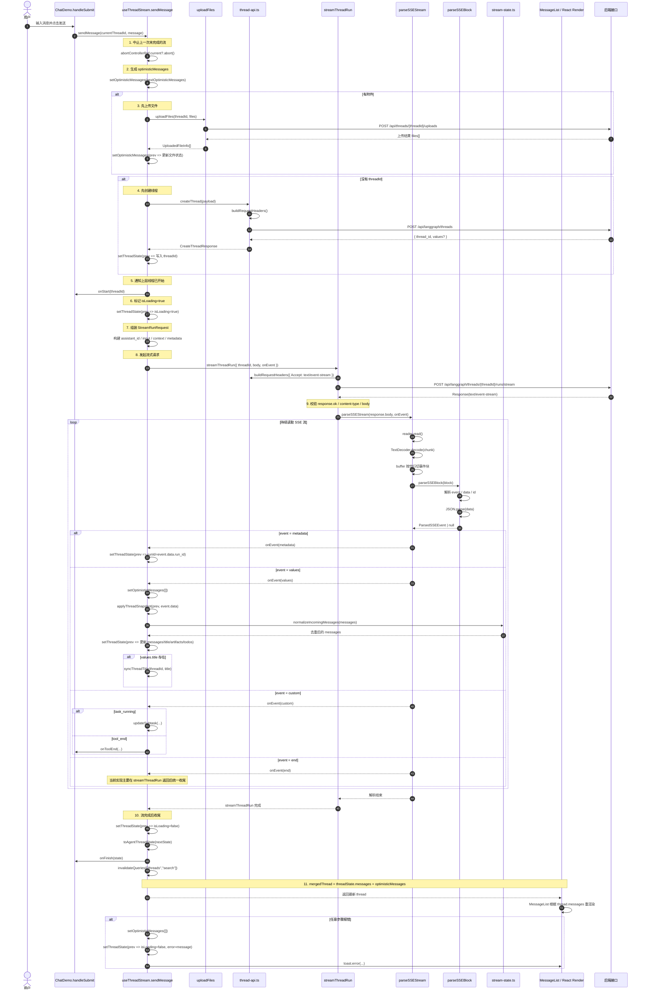
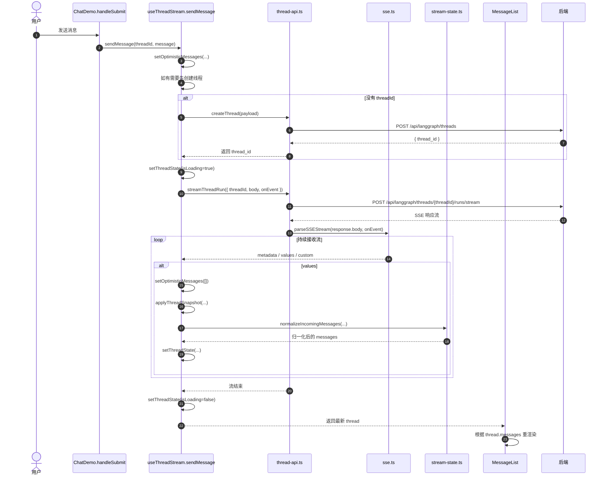

可以，这几个文件正好构成一条完整链路：`发送消息编排 -> 调接口 -> 解析 SSE -> 更新线程状态 -> 回到 UI 渲染`。

我按“用户点击发送”开始，把调用时序和每个方法的职责串起来。

**整体时序图**

```text
用户发送消息
  |
  v
[ChatDemo.handleSubmit]
  文件: [src/components/ChatDemo.tsx](/d:/github/chat-demo-webpack/src/components/ChatDemo.tsx)
  |
  | 调用 sendMessage(currentThreadId, { text, files })
  v
[useThreadStream.sendMessage]
  文件: [src/core/threads/hooks.ts](/d:/github/chat-demo-webpack/src/core/threads/hooks.ts)
  |
  | 1. abort 上一次流
  | 2. setOptimisticMessages(...) 显示临时消息
  | 3. 如有附件，调用 uploadFiles(...)
  | 4. 如无 threadId，调用 createThread(...)
  | 5. setThreadState(... isLoading=true)
  | 6. 组装 StreamRunRequest
  | 7. 调用 streamThreadRun(...)
  v
[createThread / streamThreadRun]
  文件: [src/core/api/thread-api.ts](/d:/github/chat-demo-webpack/src/core/api/thread-api.ts)
  |
  | createThread:
  |   POST /threads
  |
  | streamThreadRun:
  |   POST /threads/{threadId}/runs/stream
  |   校验 text/event-stream
  |   调 parseSSEStream(...)
  v
[parseSSEStream]
  文件: [src/core/api/sse.ts](/d:/github/chat-demo-webpack/src/core/api/sse.ts)
  |
  | 1. reader.read() 读取字节流
  | 2. TextDecoder 解码
  | 3. 以空行切分 SSE event block
  | 4. parseSSEBlock(...) 解析 event/data/id
  | 5. JSON.parse(data)
  | 6. onEvent(parsedEvent) 回调给 hooks.ts
  v
[useThreadStream.onEvent]
  文件: [src/core/threads/hooks.ts](/d:/github/chat-demo-webpack/src/core/threads/hooks.ts)
  |
  | metadata -> 保存 runId
  | values   -> setOptimisticMessages([]) + applyThreadSnapshot(...)
  | custom   -> 子任务/工具事件透传
  v
[applyThreadSnapshot]
  文件: [src/core/threads/hooks.ts](/d:/github/chat-demo-webpack/src/core/threads/hooks.ts)
  |
  | 调 normalizeIncomingMessages(...)
  v
[normalizeIncomingMessages]
  文件: [src/core/threads/stream-state.ts](/d:/github/chat-demo-webpack/src/core/threads/stream-state.ts)
  |
  | 去重 / 保序
  v
[setThreadState(...)]
  文件: [src/core/threads/hooks.ts](/d:/github/chat-demo-webpack/src/core/threads/hooks.ts)
  |
  | 更新本地 threadState
  v
[mergedThread]
  文件: [src/core/threads/hooks.ts](/d:/github/chat-demo-webpack/src/core/threads/hooks.ts)
  |
  | 把 threadState.messages + optimisticMessages 合并
  v
[ChatDemo / MessageList]
  文件: [src/components/ChatDemo.tsx](/d:/github/chat-demo-webpack/src/components/ChatDemo.tsx)
  文件: [src/components/workspace/messages/message-list.tsx](/d:/github/chat-demo-webpack/src/components/workspace/messages/message-list.tsx)
  |
  | React 重渲染消息
  v
用户看到最新内容
```

---

**一、入口层**

文件：[src/components/ChatDemo.tsx](/d:/github/chat-demo-webpack/src/components/ChatDemo.tsx)

这里主要涉及两个动作。

`handleSubmit`
- 用户点击发送后触发。
- 调用 `sendMessage(currentThreadId, { text, files: [] })`。

`useThreadStream(...)`
- 从 hook 里拿到两个东西：
  - `thread`：当前实时线程状态
  - `sendMessage`：发送消息的方法
- `thread` 会传给 `MessageList` 做展示。

作用总结：
- `ChatDemo` 是页面入口，只负责把用户动作转交给 `useThreadStream`，以及把返回的实时 thread 交给 UI。

---

**二、hooks 编排层**

文件：[src/core/threads/hooks.ts](/d:/github/chat-demo-webpack/src/core/threads/hooks.ts)

这是主控制器，最核心。

### 1. `useThreadStream(...)`

作用：
- 管理整个线程流式会话。
- 维护本地 `threadState`
- 维护 `optimisticMessages`
- 提供 `sendMessage`

内部主要初始化了：

- `threadState`
  初始值来自 `createThreadStreamState(...)`
- `optimisticMessages`
  用来临时显示“已经发送但后端还没确认”的消息
- `abortControllerRef`
  用来取消上一次未结束的流
- `streamRequestIdRef`
  防止旧请求回流污染新请求

### 2. `syncThreadTitle(nextThreadId, title)`

作用：
- 当 SSE 的 `values.title` 变化时，同步更新 React Query 里的线程列表缓存标题。

### 3. `sendMessage(maybeThreadId, message, extraContext?)`

这是整条链路的起点，时序最重要。

#### 第一步：取消旧流

```ts
abortControllerRef.current?.abort();
```

作用：
- 同一线程只保留一个活跃 stream。
- 避免旧流继续写 UI。

#### 第二步：构建 optimistic message

```ts
setOptimisticMessages(nextOptimisticMessages);
```

作用：
- 用户消息先立即显示出来。
- 如果有附件，会额外显示一条“Uploading files...”临时 AI 消息。

#### 第三步：必要时上传附件

调用外部方法：
- `uploadFiles(...)`

文件：[src/core/uploads/api.ts](/d:/github/chat-demo-webpack/src/core/uploads/api.ts)

作用：
- 把 `File` 上传到后端。
- 上传成功后，再次 `setOptimisticMessages(...)`，把文件状态改成 `uploaded`。

#### 第四步：必要时创建线程

调用：
- `createThread(...)`

文件：[src/core/api/thread-api.ts](/d:/github/chat-demo-webpack/src/core/api/thread-api.ts)

作用：
- 如果当前没有 `threadId`，先向后端创建线程。
- 返回 `thread_id` 后继续运行流式接口。

#### 第五步：通知开始

```ts
listeners.current.onStart?.(streamingThreadId);
```

作用：
- 把新的 threadId 回传给上层，例如 `ChatDemo` 里会用它更新当前线程 id。

#### 第六步：标记加载状态

```ts
setThreadState((prev) => ({
  ...prev,
  threadId: streamingThreadId,
  isLoading: true,
  error: undefined,
}));
```

作用：
- 告诉 UI：当前正在流式处理中。

#### 第七步：组装请求体

构建 `requestBody: StreamRunRequest`

内容包括：
- `assistant_id`
- `input.messages`
- `config`
- `stream_mode`
- `context`
- `metadata`

#### 第八步：发起流式请求

调用：
- `streamThreadRun(...)`

文件：[src/core/api/thread-api.ts](/d:/github/chat-demo-webpack/src/core/api/thread-api.ts)

并传入 `onEvent(event)` 回调。

#### 第九步：处理 SSE 事件

在 `onEvent` 里分支处理：

`metadata`
- 保存 `runId`

`values`
- `setOptimisticMessages([])` 清掉临时消息
- `setThreadState((prev) => applyThreadSnapshot(prev, event.data))`
- 如果有 `title`，调用 `syncThreadTitle(...)`

`custom`
- 如果后端给的是任务事件，就更新子任务状态
- 如果是工具完成事件，调用 `onToolEnd`

#### 第十步：流结束

`streamThreadRun(...)` 返回后：

- `setThreadState(... isLoading = false)`
- `listeners.current.onFinish?.(...)`
- `invalidateQueries(["threads", "search"])`

作用：
- 结束 loading
- 通知上层本次运行完成
- 刷新线程列表缓存

#### 第十一步：异常处理

如果失败：

- `setOptimisticMessages([])`
- `setThreadState(... error = xxx, isLoading = false)`
- `toast.error(...)`

作用：
- 清理临时状态
- 给用户错误提示
- 保证下一次还能继续发

---

**三、thread-api 接口层**

文件：[src/core/api/thread-api.ts](/d:/github/chat-demo-webpack/src/core/api/thread-api.ts)

这一层负责“真正调后端接口”。

### 1. `buildRequestHeaders(init?)`

作用：
- 统一构造请求头。
- 默认补 `Content-Type: application/json`
- 以后如果要加 `Authorization`，就在这里统一处理。

### 2. `parseJSONResponse(response, fallbackMessage)`

作用：
- 统一处理普通 JSON 接口的成功/失败返回。
- `response.ok === false` 时抛出标准错误。

### 3. `createThread(payload, isMock?)`

作用：
- 发 `POST /threads`
- 创建线程
- 返回 `thread_id`

被谁调用：
- `hooks.ts` 的 `sendMessage(...)`

### 4. `getThreadState(threadId, isMock?)`

作用：
- 发 `POST /threads/{threadId}/state`
- 获取线程状态

当前状态：
- 已实现，暂未接入发送主链路。

### 5. `streamThreadRun({ threadId, body, signal, isMock, onEvent })`

作用：
- 发 `POST /threads/{threadId}/runs/stream`
- 检查返回是否是 SSE
- 把 `response.body` 交给 `parseSSEStream(...)`

调用关系：

```text
sendMessage(...)
  -> streamThreadRun(...)
     -> fetch(...)
     -> parseSSEStream(...)
     -> onEvent(...)
```

---

**四、SSE 协议解析层**

文件：[src/core/api/sse.ts](/d:/github/chat-demo-webpack/src/core/api/sse.ts)

这一层只负责“把后端 SSE 文本流解析成结构化事件”。

### 1. `parseSSEBlock(block)`

输入：
- 一整个 SSE event block，类似：

```text
event: values
id: 1
data: {"messages":[]}
```

作用：
- 按行解析
- 提取 `event`、`data`、`id`
- 把多行 `data:` 拼成字符串
- `JSON.parse(...)`
- 返回统一结构的 `ParsedSSEEvent`

如果 JSON 非法：
- `console.warn(...)`
- 返回 `null`

### 2. `parseSSEStream(stream, onEvent)`

作用：
- 读取 `ReadableStream<Uint8Array>`
- `TextDecoder` 解码
- 把 buffer 按空行切分成 event block
- 每块交给 `parseSSEBlock(...)`
- 成功的话调用 `onEvent(event)`

调用关系：

```text
thread-api.streamThreadRun(...)
  -> parseSSEStream(...)
     -> parseSSEBlock(...)
     -> onEvent(...)
```

这一层不关心业务，不知道什么是 thread、message、title，只负责解析协议。

---

**五、线程状态辅助层**

文件：[src/core/threads/stream-state.ts](/d:/github/chat-demo-webpack/src/core/threads/stream-state.ts)

这一层负责“线程本地状态模型”和“消息归一化”。

### 1. `createEmptyThreadState(threadId?)`

作用：
- 创建一个空线程状态。
- 用在没有初始 thread 时。

### 2. `createThreadStreamState(threadId?, initialState?)`

作用：
- 根据现有 `ThreadState` 生成 hook 内部使用的 `ThreadStreamState`
- 如果没有初始状态，就退化到 `createEmptyThreadState(...)`

被谁调用：
- `useThreadStream(...)` 初始化时
- 切线程时重置时

### 3. `normalizeIncomingMessages(messages)`

作用：
- 清洗后端返回的消息快照
- 目前主要是：
  - 去掉重复 id
  - 保持顺序
  - 保留无 id 消息

被谁调用：
- `hooks.ts` 里的 `applyThreadSnapshot(...)`

---

**六、hooks 内的辅助方法**

文件：[src/core/threads/hooks.ts](/d:/github/chat-demo-webpack/src/core/threads/hooks.ts)

### 1. `toAgentThreadState(state)`

作用：
- 把 hook 内部的 `ThreadStreamState` 转成对外回调使用的 `AgentThreadState`
- 用在 `onFinish(...)`

### 2. `applyThreadSnapshot(prev, values)`

作用：
- 把 SSE `values` 快照应用到本地状态
- 内部会调 `normalizeIncomingMessages(...)`

逻辑是：
- 如果 `values.messages` 存在，替换本地 messages
- 同步 `title/artifacts/todos`
- 清除旧错误状态

---

**七、渲染层怎么接上**

文件：
- [src/components/ChatDemo.tsx](/d:/github/chat-demo-webpack/src/components/ChatDemo.tsx)
- [src/components/workspace/messages/message-list.tsx](/d:/github/chat-demo-webpack/src/components/workspace/messages/message-list.tsx)

时序上它们在最后面。

`ChatDemo`
- 调 `useThreadStream(...)`
- 拿到 `thread`
- 把 `thread` 传给 `MessageList`

`MessageList`
- 只关心：
  - `thread.messages`
  - `thread.isLoading`

作用：
- 完全不需要知道 SSE 细节
- 只负责把消息渲染出来

---

**八、附件上传链路**

额外涉及文件：[src/core/uploads/api.ts](/d:/github/chat-demo-webpack/src/core/uploads/api.ts)

方法：
- `uploadFiles(threadId, files)`

调用时机：
- `sendMessage(...)` 中，如果用户带了附件，先上传再发运行请求。

作用：
- 返回文件元数据
- 再把这些元数据写进 optimistic message 和最终提交的 `input.messages`

---

**九、本地 mock 联调链路**

额外涉及文件：[src/core/mock/mock-server.cjs](/d:/github/chat-demo-webpack/src/core/mock/mock-server.cjs)

这里模拟了：

- `POST /mock/api/threads`
- `POST /mock/api/threads/:threadId/runs/stream`

它会持续发送：

- `event: metadata`
- `event: values`
- `event: end`

作用：
- 本地开发时，不用真后端也能跑完整条 SSE 流程。

---

**十、最简调用链总结**

可以把这几个方法压缩成一条主线：

```text
ChatDemo.handleSubmit
  -> useThreadStream.sendMessage
    -> uploadFiles (可选)
    -> createThread (可选)
    -> streamThreadRun
      -> fetch POST /runs/stream
      -> parseSSEStream
        -> parseSSEBlock
      -> onEvent(metadata / values / custom)
    -> applyThreadSnapshot
      -> normalizeIncomingMessages
    -> setThreadState
  -> MessageList 重渲染
```

---

**十一、每个方法一句话职责表**

`src/core/threads/hooks.ts`
- `useThreadStream`：管理整条线程流式会话
- `sendMessage`：发送消息总入口
- `syncThreadTitle`：同步线程标题到缓存
- `applyThreadSnapshot`：把后端快照写入本地状态
- `toAgentThreadState`：转换完成态回调数据

`src/core/api/thread-api.ts`
- `buildRequestHeaders`：统一请求头
- `parseJSONResponse`：统一处理普通 JSON 接口
- `createThread`：创建线程
- `getThreadState`：获取线程状态
- `streamThreadRun`：发起 SSE 流式请求

`src/core/api/sse.ts`
- `parseSSEBlock`：解析单个 SSE 事件块
- `parseSSEStream`：解析整个 SSE 字节流

`src/core/threads/stream-state.ts`
- `createEmptyThreadState`：创建空线程状态
- `createThreadStreamState`：创建 hook 内部线程状态
- `normalizeIncomingMessages`：归一化消息快照

---





